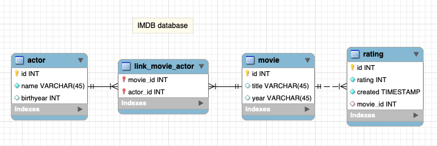

# How to fix circular references in DTO's
## A.K.A. how to avoid stack overflow when converting DTO's with GSON

This repo cotains sample code, that shows how to make DTO's with inner classes.
This enables you to tweak the JSON you wish to convert from objects by GSON. Look
carefully at the MovieDTO class. 

This project is built on start code for projects and exercises given in Flow-1

## Tutorial
Watch the [video on Panopto](https://cphbusiness.cloud.panopto.eu/Panopto/Pages/Viewer.aspx?id=9f689178-b4b7-4bbf-96ce-af1f0126ff50) with full demo

## The database

### Preconditions
In order to use this code, you should have a local developer setup + a 
"matching" droplet on Digital Ocean as described in the 3. semester guidelines 

### Getting Started

1. Clone the project
2. Open in IntelliJ
3. Run the content of the /resources/imdb.sql in Workbench to create a database with some some data
3. Create a "Run-configuration" in IntelliJ for Tomcat
4. Hit play
5. The getAllMovies is accessible via the endpoint: http://localhost:8080/imdb/api/movie/all
